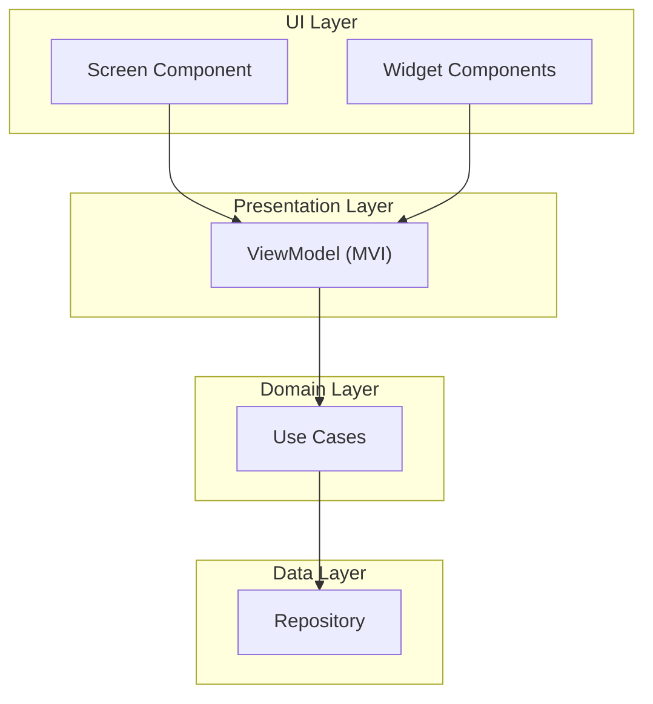
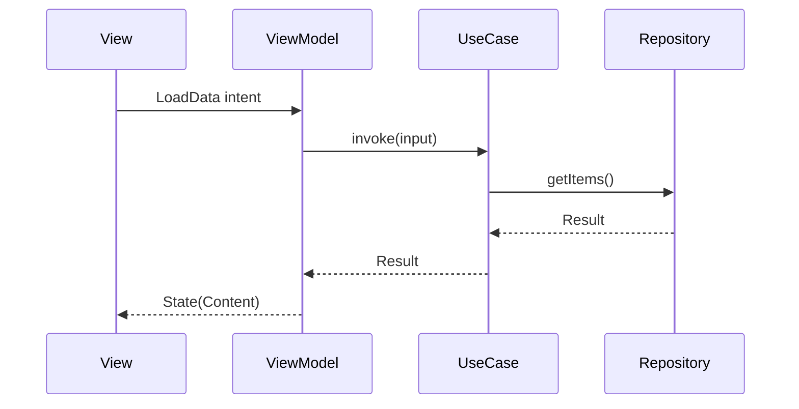

# Technical Design — {Epic Name}

> **Level**: L2 (Epic)
> **Parent PRD**: [PRD.md](./PRD.md) `cpt-{hierarchy-prefix}-prd`
> **Parent MiniApp Design**: [../DESIGN.md](../DESIGN.md)

- [ ] `p3` - **ID**: `cpt-{hierarchy-prefix}-design-epic`

## Table of Contents

<!-- generated by `cfs toc` -->

## 1. Architecture Overview

### 1.1 Architectural Vision

{1-2 paragraphs: what this screen/flow/capability provides and the design approach chosen for it. Reference the MiniApp architecture rather than redefining it.}

**Epic Type**: Screen | Capability | Flow | Widget

**ADRs**: `cpt-{hierarchy-prefix}-adr-{slug}`

### 1.2 Architecture Drivers

**ADRs**: `cpt-{hierarchy-prefix}-adr-{slug}`

#### Functional Drivers

| Requirement | Design Response |
|-------------|------------------|
| `cpt-{hierarchy-prefix}-fr-{slug}` | {How this design addresses the requirement} |

#### NFR Allocation

| NFR ID | NFR Summary | Allocated To | Design Response | Verification Approach |
|--------|-------------|--------------|-----------------|----------------------|
| `cpt-{hierarchy-prefix}-nfr-{slug}` | {Brief NFR description} | {Component/mechanism} | {How this design element realizes the NFR} | {How compliance is verified} |

**Inherited NFRs**: {List MiniApp/platform NFR IDs this epic inherits without change; document deviations only.}

### 1.3 Component Overview

- [ ] `p1` - **ID**: `cpt-{hierarchy-prefix}-component-overview`



| Element | Responsibility | Technology | Location |
|---------|---------------|------------|----------|
| {Epic}ViewModel | State reduction for this screen | Kotlin (shared) | `constructor-sdk/feature/{miniapp}/presentation/{epic}/` |
| {Epic}Screen | Android UI | Jetpack Compose | `android-app/feature/{miniapp}/ui/{epic}/` |
| {Epic}View | iOS UI | SwiftUI | `ios-app/Features/{MiniApp}/Views/{Epic}/` |

## 2. Principles & Constraints

### 2.1 Design Principles

#### {Principle Name}

- [ ] `p2` - **ID**: `cpt-{hierarchy-prefix}-principle-{slug}`

{Description and why it applies to this epic. MiniApp and platform principles are referenced by ID, not restated.}

**ADRs**: `cpt-{hierarchy-prefix}-adr-{slug}`

### 2.2 Constraints

#### {Constraint Name}

- [ ] `p2` - **ID**: `cpt-{hierarchy-prefix}-constraint-{slug}`

{Description and design impact — e.g., an existing backend shape, a design-system limitation, an OS behavior this screen must obey. Inherited constraints are referenced by ID.}

**ADRs**: `cpt-{hierarchy-prefix}-adr-{slug}`

## 3. Technical Architecture

### 3.1 Domain Model

**Entities used by this epic** (owned by the MiniApp domain module):

| Entity | MiniApp Entity ID | Fields Used | Read/Write |
|--------|-------------------|-------------|------------|
| `{Entity}` | `cpt-{miniapp-prefix}-entity-{slug}` | {fields} | {read / read-write} |

**Epic-specific models** {only if this epic introduces a model the MiniApp domain does not own}:

- [ ] `p2` - **ID**: `cpt-{hierarchy-prefix}-entity-{slug}`

**Location**: `constructor-sdk/feature/{miniapp}/presentation/{epic}/model/`

### 3.2 Component Model

#### {Component Name, e.g., {Screen Name} Screen}

- [ ] `p1` - **ID**: `cpt-{hierarchy-prefix}-component-{slug}`

##### Why this component exists

{What part of the epic it realizes.}

##### Responsibility scope

{What it owns: rendering, input handling, state reduction, or data access.}

##### Responsibility boundaries

{What it does NOT do; what is delegated to the ViewModel, the MiniApp repository, or the kernel.}

##### Technology and location

**Technology**: {Compose | SwiftUI | Kotlin shared}

**Location**: {path}

##### Related components (by ID)

- `cpt-{hierarchy-prefix}-component-{slug}` — {renders | dispatches intents to | observes state of | depends on}

#### {Widget Name}

- [ ] `p2` - **ID**: `cpt-{hierarchy-prefix}-widget-{slug}`

**PRD widget ID**: `cpt-{hierarchy-prefix}-widget-{slug}` (same ID as declared in the epic PRD)

**Responsibility**: {What this widget does}

**States**: {default, loading, error, empty, success}

**Parameters**:
- `{param}`: {type} — {description}

**Reused from**: {design system component | epic-local}

### 3.3 API Contracts

- [ ] `p2` - **ID**: `cpt-{hierarchy-prefix}-interface-{slug}`

- **Contracts**: `cpt-{hierarchy-prefix}-contract-{slug}`
- **Technology**: {REST/JSON via the MiniApp repository | WebSocket | JS bridge}
- **Location**: [{contract-file}]({path})
- **Stability**: {stable | unstable | experimental}

**Endpoints used by this epic**:

| Method | Endpoint | Request | Response | Owning MiniApp Contract |
|--------|----------|---------|----------|-------------------------|
| `GET` | `/api/v1/mobile/{miniapp}/{epic}` | — | `{ResponseDTO}` | `cpt-{miniapp-prefix}-contract-{slug}` |

**Repository operations**:

- [ ] `p1` - **ID**: `cpt-{hierarchy-prefix}-repo-{slug}`

| Operation | Method | Source | Caching |
|-----------|--------|--------|---------|
| Get list | `getItems()` | Remote + local | Cache-first |
| Save item | `saveItem(item)` | Remote → local | Write-through |

**Use cases**:

- [ ] `p1` - **ID**: `cpt-{hierarchy-prefix}-usecase-{slug}`

| Use Case | Input | Output | Repository Operations |
|----------|-------|--------|-----------------------|
| `{UseCase}UseCase` | `{InputType}` | `Result<{OutputType}>` | {operations invoked} |

### 3.4 Internal Dependencies

| Dependency | Interface Used | Purpose |
|------------|----------------|---------|
| {MiniApp repository} | `cpt-{miniapp-prefix}-repo-{slug}` | {Why this epic needs it} |
| {Kernel service} | `cpt-superapp-contract-{slug}` | {Why this epic needs it} |
| {Design system component} | {component name} | {Why this epic needs it} |

**Dependency Rules**:
- This epic depends on MiniApp repositories and kernel contracts, never on another epic's internals
- Navigation to another epic goes through the MiniApp navigation graph
- UI components never call repositories directly; all data access goes through the ViewModel

### 3.5 External Dependencies

| External System | Direction | Protocol | Contract | Failure Mode |
|-----------------|-----------|----------|----------|--------------|
| {Backend capability} | {consumed} | {REST/WebSocket} | `cpt-{miniapp-prefix}-contract-{slug}` | {What this screen shows} |

### 3.6 Interactions & Sequences

#### {Sequence Name, e.g., Load Screen Data}

**ID**: `cpt-{hierarchy-prefix}-seq-{slug}`

**Use cases**: `cpt-{hierarchy-prefix}-usecase-{slug}`

**Actors**: `cpt-superapp-actor-{slug}` (ID from platform PRD)



**Description**: {What this sequence accomplishes, including the failure branch}

### 3.7 Caching & Local State

- [ ] `p2` - **ID**: `cpt-{hierarchy-prefix}-db-{slug}`

**Store**: {MiniApp store reused, by ID | epic-local cache}

| Data | Store | Freshness Policy | Eviction |
|------|-------|------------------|----------|
| {data} | {store} | {TTL / on-open refresh / push-invalidated} | {policy} |

**Epic-local table** {only if this epic introduces one}:

**ID**: `cpt-{hierarchy-prefix}-dbtable-{slug}`

| Column | Type | Description |
|--------|------|-------------|
| {col} | {type} | {description} |

### 3.8 Rollout & Feature Gating

- [ ] `p3` - **ID**: `cpt-{hierarchy-prefix}-topology-{slug}`

| Gate | Mechanism | Default | Removal Condition |
|------|-----------|---------|-------------------|
| {feature flag name} | {remote config / build flavor} | {off/on} | {When the flag is retired} |

**Fallback when gated off**: {What the user sees instead}

## 4. State Management

### 4.1 Screen State

- [ ] `p1` - **ID**: `cpt-{hierarchy-prefix}-state-screen`

{Map each PRD state requirement (`cpt-{hierarchy-prefix}-state-{slug}`) to a modelled state value.}

```kotlin
data class {Epic}State(
    val screenState: ScreenState = ScreenState.Loading,
    val {field1}: {Type} = {default},
)

sealed class ScreenState {
    object Loading : ScreenState()
    data class Content(val data: {DataType}) : ScreenState()
    object Empty : ScreenState()
    data class Error(val kind: ErrorKind) : ScreenState()
    object Offline : ScreenState()
}
```

| PRD State ID | Modelled As | Entry Condition |
|--------------|-------------|-----------------|
| `cpt-{hierarchy-prefix}-state-{slug}` | `ScreenState.{Value}` | {condition} |

### 4.2 User Intents

```kotlin
sealed class {Epic}Intent {
    object LoadData : {Epic}Intent()
    data class OnItemClick(val id: String) : {Epic}Intent()
    data class OnInputChange(val value: String) : {Epic}Intent()
    object OnSubmit : {Epic}Intent()
    object OnRefresh : {Epic}Intent()
}
```

### 4.3 Side Effects

```kotlin
sealed class {Epic}Effect {
    data class Navigate(val route: String) : {Epic}Effect()
    data class ShowSnackbar(val message: String) : {Epic}Effect()
    data class ShowDialog(val config: DialogConfig) : {Epic}Effect()
}
```

### 4.4 State Restoration

{What survives process death and configuration change, and what the user sees on return.}

## 5. Navigation

### 5.1 Entry And Exit Points

- [ ] `p2` - **ID**: `cpt-{hierarchy-prefix}-component-nav`

**Entry points**:
- From {previous screen} via {action}
- Deep link: `{scheme}://{miniapp}/{epic}?{params}` — realizes `cpt-{hierarchy-prefix}-interface-{slug}` from the PRD
- Notification tap: {category}, where applicable

**Exit points**:
- To {next screen} via {action}
- Back / dismiss: {target and unsaved-state handling}

### 5.2 Navigation Parameters

| Parameter | Type | Required | Validation | Behavior When Invalid |
|-----------|------|----------|-----------|-----------------------|
| `{param1}` | String | Yes | {rule} | {fallback} |

## 6. Platform-Specific Considerations

### 6.1 Android

- [ ] `p2` - **ID**: `cpt-{hierarchy-prefix}-tech-android`

**Compose specifics**: {Composition structure, recomposition concerns, paging}

**Lifecycle handling**: {Configuration change, process death, back handling}

### 6.2 iOS

- [ ] `p2` - **ID**: `cpt-{hierarchy-prefix}-tech-ios`

**SwiftUI specifics**: {View structure, observation, list rendering}

**Lifecycle handling**: {Scene phases, state restoration, swipe-to-dismiss}

### 6.3 WebView Integration

{If this epic uses WebView}

- [ ] `p2` - **ID**: `cpt-{hierarchy-prefix}-tech-webview`

**WebView URL**: `{webview-base-url}/{path}`

**JS bridge methods**: `{method}(params)` — {description}

**Native → WebView events**: `{event}` — {when triggered}

**WebView → native events**: `{event}` — {what it triggers}

**Session propagation**: {How the session reaches the page, and its security properties}

## 7. Error Handling & Offline

### 7.1 Error States

{Realizes the epic PRD's error handling table. One row per PRD error condition.}

| PRD Error Condition | Detection | UI Response | Recovery Action |
|---------------------|-----------|-------------|-----------------|
| {condition} | {how the code detects it} | {state shown} | {retry / navigate / fix input} |

### 7.2 Offline Behavior

- [ ] `p2` - **ID**: `cpt-{hierarchy-prefix}-tech-offline`

**Offline capable**: Yes / No

- **Read**: {How reads resolve offline and how staleness is signalled}
- **Write**: {Queued / blocked / degraded, and the queue used}
- **Sync**: {How and when queued work is flushed, and conflict handling}

## 8. Additional Context

{Known debt, deviations from the MiniApp pattern, open dependencies.}

## 9. Traceability

- **Epic PRD**: [PRD.md](./PRD.md)
- **MiniApp DESIGN**: [../DESIGN.md](../DESIGN.md)
- **ADRs**: [adr/](./adr/)
- **DECOMPOSITION**: [DECOMPOSITION.md](./DECOMPOSITION.md)
- **Features**: [features/](./features/)

### Requirement Coverage

| PRD Requirement | Design Element |
|-----------------|----------------|
| `cpt-{hierarchy-prefix}-fr-{slug}` | `cpt-{hierarchy-prefix}-component-{slug}` |
| `cpt-{hierarchy-prefix}-state-{slug}` | `ScreenState.{Value}` (see 4.1) |
| `cpt-{hierarchy-prefix}-widget-{slug}` | `cpt-{hierarchy-prefix}-widget-{slug}` (see 3.2) |
| `cpt-{hierarchy-prefix}-nfr-{slug}` | {Component/mechanism, see 1.2 NFR Allocation} |
