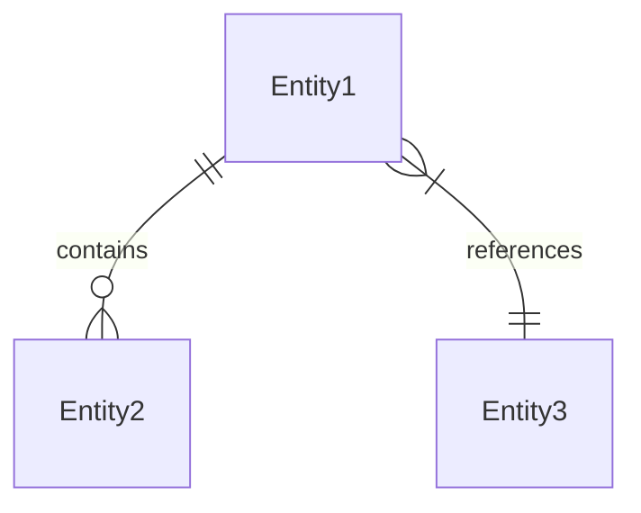
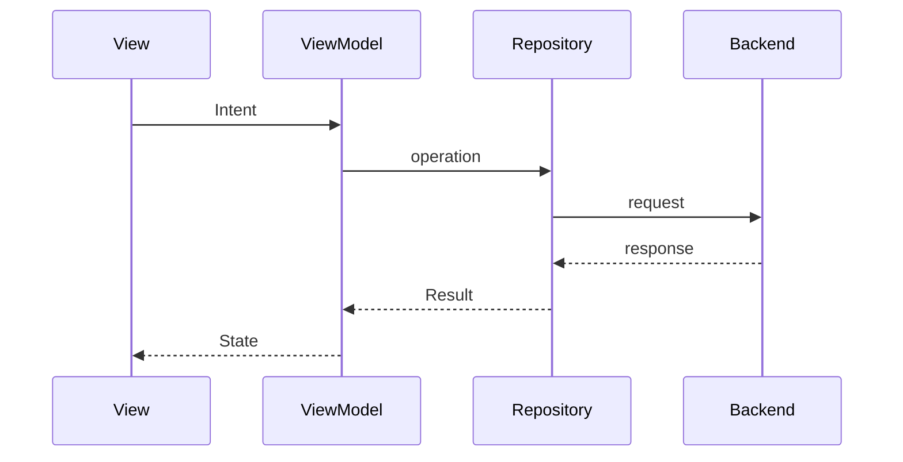
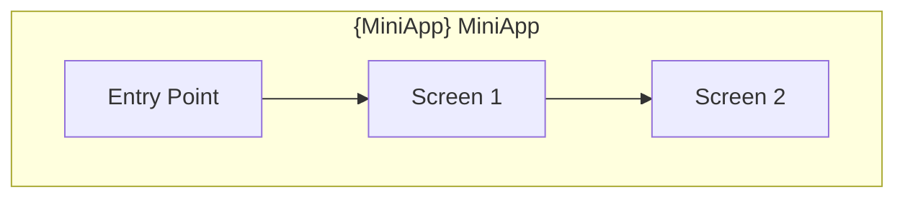

# Technical Design — {MiniApp Name} MiniApp

> **Level**: L1 (MiniApp)
> **Parent PRD**: [PRD.md](./PRD.md) `cpt-{hierarchy-prefix}-prd`
> **Parent Platform Design**: [../DESIGN.md](../DESIGN.md)

- [ ] `p3` - **ID**: `cpt-{hierarchy-prefix}-design-miniapp`

## Table of Contents

<!-- generated by `cfs toc` -->

## 1. Architecture Overview

### 1.1 Architectural Vision

{1-2 paragraphs: what this MiniApp provides, how its internal architecture serves that, and how it fits the platform architecture. Reference the platform layers rather than redefining them.}

**ADRs**: `cpt-{hierarchy-prefix}-adr-{slug}`

### 1.2 Architecture Drivers

Requirements from the MiniApp PRD that shape this design.

**ADRs**: `cpt-{hierarchy-prefix}-adr-{slug}`

#### Functional Drivers

| Requirement | Design Response |
|-------------|------------------|
| `cpt-{hierarchy-prefix}-fr-{slug}` | {How the MiniApp architecture addresses this requirement} |

#### NFR Allocation

| NFR ID | NFR Summary | Allocated To | Design Response | Verification Approach |
|--------|-------------|--------------|-----------------|----------------------|
| `cpt-{hierarchy-prefix}-nfr-{slug}` | {Brief NFR description} | {Module/component} | {How this design element realizes the NFR} | {How compliance is verified} |

**Inherited platform NFRs**: {List platform NFR IDs this MiniApp inherits without change; document deviations only.}

### 1.3 Module Structure

- [ ] `p1` - **ID**: `cpt-{hierarchy-prefix}-tech-modules`

```
{miniapp}/
├── constructor-sdk/feature/{miniapp}/     # KMP shared logic
│   ├── domain/                            # Domain entities, repository interfaces, use cases
│   ├── data/                              # Repository implementations, API clients, local sources
│   └── presentation/                      # ViewModels (MVI), state, intents, effects
│
├── android-app/feature/{miniapp}/          # Android UI
│   ├── ui/                                # Compose screens and components
│   └── navigation/                        # Navigation graph
│
└── ios-app/Features/{MiniApp}/             # iOS UI
    ├── Views/                             # SwiftUI views
    └── Navigation/                        # Coordinators
```

| Module | Responsibility | Technology | Location |
|--------|---------------|------------|----------|
| Domain | Business entities and rules for this MiniApp | Kotlin (shared) | `constructor-sdk/feature/{miniapp}/domain/` |
| Data | Repository implementations, remote and local sources | Ktor, SQLDelight | `constructor-sdk/feature/{miniapp}/data/` |
| Presentation | State management (MVI) | Kotlin (shared) | `constructor-sdk/feature/{miniapp}/presentation/` |
| Android UI | Compose screens, navigation | Jetpack Compose | `android-app/feature/{miniapp}/` |
| iOS UI | SwiftUI views, coordinators | SwiftUI | `ios-app/Features/{MiniApp}/` |

## 2. Principles & Constraints

### 2.1 Design Principles

#### {Principle Name, e.g., Unidirectional State Flow (MVI)}

- [ ] `p1` - **ID**: `cpt-{hierarchy-prefix}-principle-{slug}`

{Description of the principle and why it applies to this MiniApp. Platform-wide principles are referenced by platform ID, not restated. See section 5 for the concrete MVI contracts this principle governs.}

**ADRs**: `cpt-{hierarchy-prefix}-adr-{slug}`

### 2.2 Constraints

#### {Constraint Name}

- [ ] `p2` - **ID**: `cpt-{hierarchy-prefix}-constraint-{slug}`

{Description and design impact. Inherited platform constraints are referenced by platform ID; document only MiniApp-specific constraints and deviations.}

**ADRs**: `cpt-{hierarchy-prefix}-adr-{slug}`

## 3. Technical Architecture

### 3.1 Domain Model

**Technology**: {Kotlin data classes in the shared domain module}

**Location**: [{domain-model-path}](constructor-sdk/feature/{miniapp}/domain/model/)

**Core Entities**:

- [ ] `p1` - **ID**: `cpt-{hierarchy-prefix}-entity-{slug}`

| Entity | Description | Location |
|--------|-------------|----------|
| `{Entity1}` | {Purpose} | `constructor-sdk/feature/{miniapp}/domain/model/` |

**Relationships**:



**Repository Interfaces**:

- [ ] `p1` - **ID**: `cpt-{hierarchy-prefix}-repo-{slug}`

```kotlin
interface {MiniApp}Repository {
    suspend fun getItems(): Result<List<{Entity}>>
    suspend fun getItem(id: String): Result<{Entity}>
    suspend fun saveItem(item: {Entity}): Result<Unit>
}
```

### 3.2 Component Model

{Document each module and cross-cutting component of this MiniApp. Include a component diagram showing structure and relationships.}

#### {Component Name, e.g., Data Module}

- [ ] `p1` - **ID**: `cpt-{hierarchy-prefix}-component-{slug}`

##### Why this component exists

{What problem it solves within this MiniApp.}

##### Responsibility scope

{What it owns: entities, operations, invariants.}

##### Responsibility boundaries

{What it does NOT do; what is delegated to the kernel, to another module, or to an epic-level component.}

##### Technology and location

**Technology**: {e.g., Ktor client + SQLDelight}

**Location**: {e.g., `constructor-sdk/feature/{miniapp}/data/`}

##### Related components (by ID)

- `cpt-{hierarchy-prefix}-component-{slug}` — {depends on | calls | publishes to | subscribes to | shares model with | owns data for}

### 3.3 API Contracts

{Contracts this MiniApp consumes from backends and exposes to the host. Realizes the interfaces declared in the PRD's Public MiniApp Interfaces section.}

- [ ] `p2` - **ID**: `cpt-{hierarchy-prefix}-interface-{slug}`

- **Contracts**: `cpt-{hierarchy-prefix}-contract-{slug}`
- **Technology**: {REST/JSON over the network kernel | WebSocket | Kotlin interface}
- **Location**: [{contract-file}]({path})
- **Stability**: {stable | unstable | experimental}

**Backend Endpoints**:

| Method | Endpoint | Description | Request | Response |
|--------|----------|-------------|---------|----------|
| `GET` | `/api/v1/mobile/{miniapp}/{resource}` | {Description} | — | `List<{DTO}>` |
| `POST` | `/api/v1/mobile/{miniapp}/{resource}` | {Description} | `{RequestDTO}` | `{DTO}` |

**Real-Time Channels** {if applicable}:

- [ ] `p3` - **ID**: `cpt-{hierarchy-prefix}-ws-{slug}`

| Connection | Purpose | Events |
|------------|---------|--------|
| `wss://{host}/{miniapp}/events` | {Purpose} | `{event1}`, `{event2}` |

**Host Contract Implementation**:

```kotlin
class {MiniApp}MiniApp : MiniApp {
    override val id = "{miniapp}"
    override val name = "{MiniApp Name}"
    override val version = "1.0.0"

    override fun initialize(kernel: Kernel) { /* DI, repositories */ }
    override fun start(): MiniAppScreen = {MiniApp}EntryScreen(kernel)
    override fun handleDeepLink(uri: Uri): Boolean { /* route within this MiniApp */ }
    override fun onBackground() { /* persist state */ }
    override fun onForeground() { /* refresh */ }
    override fun dispose() { /* release resources */ }
}
```

### 3.4 Internal Dependencies

**Required Kernel Services**:

| Service | Kernel Contract | Usage | Criticality |
|---------|-----------------|-------|-------------|
| Auth | `cpt-superapp-contract-{slug}` | {How this MiniApp uses auth} | p1 |
| Storage | `cpt-superapp-contract-{slug}` | {How this MiniApp uses storage} | p1 |
| Network | `cpt-superapp-contract-{slug}` | {How this MiniApp uses network} | p1 |
| Notifications | `cpt-superapp-contract-{slug}` | {How this MiniApp uses notifications} | p2 |

**Module Dependencies**:

| Dependency Module | Interface Used | Purpose |
|-------------------|----------------|---------|
| {module_name} | {contract / DI-provided service} | {Why this module is needed} |

**Dependency Rules**:
- This MiniApp depends on kernel contracts only, never on another MiniApp
- Platform UI modules depend on the shared module, never the reverse
- Presentation depends on domain; domain never depends on data or presentation
- Cross-MiniApp navigation goes through the platform router

### 3.5 External Dependencies

| External System | Direction | Protocol | Contract | Failure Mode |
|-----------------|-----------|----------|----------|--------------|
| {Backend capability} | {consumed} | {REST/WebSocket} | `cpt-{hierarchy-prefix}-contract-{slug}` | {Degraded/offline behavior} |

### 3.6 Interactions & Sequences

#### {Sequence Name}

**ID**: `cpt-{hierarchy-prefix}-seq-{slug}`

**Use cases**: `cpt-{hierarchy-prefix}-usecase-{slug}` (ID from PRD)

**Actors**: `cpt-superapp-actor-{slug}` (ID from platform PRD)



**Description**: {What this sequence accomplishes}

### 3.7 Local Data Stores & Schemas

- [ ] `p2` - **ID**: `cpt-{hierarchy-prefix}-db-{slug}`

**Technology**: {SQLDelight | DataStore/UserDefaults | in-memory cache}

#### Table: {table_name}

**ID**: `cpt-{hierarchy-prefix}-dbtable-{slug}`

| Column | Type | Description |
|--------|------|-------------|
| {col} | {type} | {description} |

**PK**: {primary key column(s)}

**Constraints**: {NOT NULL, UNIQUE, FK}

**Additional info**: {Indexes, migrations, retention, encryption where the data is sensitive}

### 3.8 Module Build Topology

- [ ] `p3` - **ID**: `cpt-{hierarchy-prefix}-topology-{slug}`

| Target | Build Unit | Consumed By |
|--------|-----------|-------------|
| {Shared feature module} | {Gradle module} | {Android app, iOS app} |
| {Android feature module} | {Gradle module} | {Android app} |
| {iOS feature target} | {Tuist target} | {iOS app} |

## 4. Navigation Architecture

### 4.1 Navigation Graph

- [ ] `p2` - **ID**: `cpt-{hierarchy-prefix}-component-navigation`



**Screen Inventory**:

| Screen | Route | Epic | Implementation |
|--------|-------|------|----------------|
| {Screen1} | `/{miniapp}/{screen1}` | `cpt-{hierarchy-prefix}-{epic}-prd` | Native / WebView |

### 4.2 Deep Links

- [ ] `p2` - **ID**: `cpt-{hierarchy-prefix}-deeplink-schema`

| Deep Link | Target Screen | Parameters | Auth Required |
|-----------|---------------|------------|---------------|
| `{scheme}://{miniapp}/{path}` | {Screen} | `{param1}`, `{param2}` | {yes/no} |

**Handling**:
1. Host receives the link and resolves the MiniApp segment via the registry
2. This MiniApp validates parameters and resolves the target route
3. Unknown or unauthorized links fall back to {behavior}
4. Cold-start links are handled after `initialize(kernel)` completes

## 5. State Management

### 5.1 MVI Contracts

- [ ] `p1` - **ID**: `cpt-{hierarchy-prefix}-component-state`

```
┌──────────────────────────────────────────────────────────────┐
│                        VIEW (UI)                              │
│  Compose / SwiftUI screen  ←── state ── immutable State       │
│          │ intent                    ↑                        │
│          ↓                           │                        │
│  VIEWMODEL: Intent → Reducer → State                          │
│                ↓                                              │
│          Side Effects → Repository                            │
└──────────────────────────────────────────────────────────────┘
```

```kotlin
data class {MiniApp}State(
    val isLoading: Boolean = false,
    val data: List<{Entity}> = emptyList(),
    val error: String? = null,
)

sealed class {MiniApp}Intent {
    object Load : {MiniApp}Intent()
    data class Select(val id: String) : {MiniApp}Intent()
}

sealed class {MiniApp}Effect {
    data class Navigate(val route: String) : {MiniApp}Effect()
    data class ShowError(val message: String) : {MiniApp}Effect()
}
```

### 5.2 State Persistence

- [ ] `p2` - **ID**: `cpt-{hierarchy-prefix}-component-state-persistence`

**Persisted state**: {What survives process death and where it is stored (see 3.7)}

**Transient state**: {What is intentionally not persisted}

**Restore behavior**: {What the user sees on return: restored position, refreshed data, or cold entry}

## 6. Additional Context

{Migration state, known debt, platform-specific caveats, open dependencies.}

## 7. Traceability

- **MiniApp PRD**: [PRD.md](./PRD.md)
- **Platform DESIGN**: [../DESIGN.md](../DESIGN.md)
- **ADRs**: [adr/](./adr/)
- **DECOMPOSITION**: [DECOMPOSITION.md](./DECOMPOSITION.md)
- **Epics**: [screens/](./screens/), [capabilities/](./capabilities/), [flows/](./flows/)

### Requirement Coverage

| PRD Requirement | Design Element |
|-----------------|----------------|
| `cpt-{hierarchy-prefix}-fr-{slug}` | `cpt-{hierarchy-prefix}-component-{slug}` |
| `cpt-{hierarchy-prefix}-nfr-{slug}` | {Module/mechanism, see 1.2 NFR Allocation} |
| `cpt-{hierarchy-prefix}-interface-{slug}` | `cpt-{hierarchy-prefix}-contract-{slug}` |
