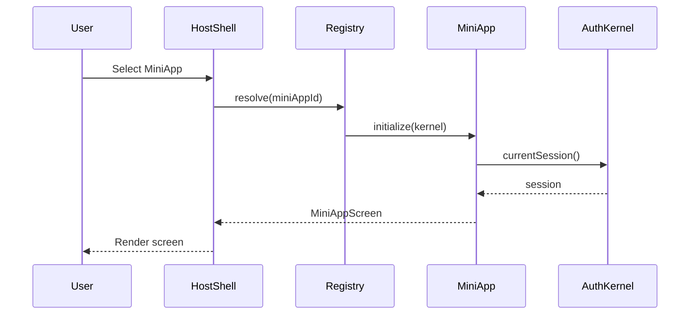

# Technical Design — {Platform Name} Mobile Platform

> **Level**: L0 (Platform / Host App)
> **Parent PRD**: [PRD.md](./PRD.md) `cpt-{hierarchy-prefix}-prd`

- [ ] `p3` - **ID**: `cpt-{hierarchy-prefix}-design-platform`

## Table of Contents

<!-- generated by `cfs toc` -->

## 1. Architecture Overview

### 1.1 Architectural Vision

{2-3 paragraphs: Technical approach, key architectural decisions, design philosophy. How does this platform architecture satisfy the business goals from the PRD?}

**ADRs**: `cpt-{hierarchy-prefix}-adr-{slug}`

### 1.2 Architecture Drivers

Requirements that significantly influence platform architecture decisions.

**ADRs**: `cpt-{hierarchy-prefix}-adr-{slug}`

#### Functional Drivers

| Requirement | Design Response |
|-------------|------------------|
| `cpt-{hierarchy-prefix}-fr-{slug}` | {How the platform architecture addresses this requirement} |

#### NFR Allocation

This table maps non-functional requirements from the PRD to specific design responses, demonstrating how quality attributes are realized.

| NFR ID | NFR Summary | Allocated To | Design Response | Verification Approach |
|--------|-------------|--------------|-----------------|----------------------|
| `cpt-{hierarchy-prefix}-nfr-{slug}` | {Brief NFR description} | {Layer/module/mechanism} | {How this design element realizes the NFR} | {How compliance is verified} |

### 1.3 Architecture Layers

```
┌─────────────────────────────────────────────────────────────┐
│                    PRESENTATION LAYER                        │
│  ┌─────────────────┐  ┌─────────────────┐                   │
│  │   iOS Native    │  │  Android Native │    Native Shell   │
│  │    (SwiftUI)    │  │   (Compose)     │                   │
│  └────────┬────────┘  └────────┬────────┘                   │
│           │                    │                             │
│  ┌────────┴────────────────────┴────────┐                   │
│  │            WebView Container          │    Hybrid Layer  │
│  └───────────────────┬──────────────────┘                   │
└──────────────────────┼──────────────────────────────────────┘
                       │
┌──────────────────────┼──────────────────────────────────────┐
│                 APPLICATION LAYER                            │
│  ┌───────────────────┴──────────────────┐                   │
│  │              KMP SDK                  │    Shared Logic  │
│  │  ┌──────────┐  ┌──────────┐          │                   │
│  │  │ViewModels│  │ Use Cases│          │                   │
│  │  └──────────┘  └──────────┘          │                   │
│  └──────────────────────────────────────┘                   │
└─────────────────────────────────────────────────────────────┘
                       │
┌──────────────────────┼──────────────────────────────────────┐
│                   DOMAIN LAYER                               │
│  ┌──────────────────────────────────────┐                   │
│  │           Domain Entities             │   Business Model │
│  └──────────────────────────────────────┘                   │
└─────────────────────────────────────────────────────────────┘
                       │
┌──────────────────────┼──────────────────────────────────────┐
│               INFRASTRUCTURE LAYER                           │
│  ┌──────────┐  ┌──────────┐  ┌──────────┐                   │
│  │ Network  │  │ Storage  │  │   Auth   │   Platform APIs   │
│  └──────────┘  └──────────┘  └──────────┘                   │
└─────────────────────────────────────────────────────────────┘
```

- [ ] `p1` - **ID**: `cpt-{hierarchy-prefix}-tech-layers`

| Layer | Responsibility | Technology | Location |
|-------|---------------|------------|----------|
| Presentation | Native UI shell, navigation, platform-specific UX | SwiftUI (iOS), Jetpack Compose (Android) | `ios-app/`, `android-app/` |
| Application | Business logic, state management, use cases | Kotlin Multiplatform (KMP) | `constructor-sdk/` |
| Domain | Core entities, business rules | Kotlin (shared) | `constructor-sdk/common/domain/` |
| Infrastructure | Network, storage, platform APIs | Ktor, SQLDelight, platform-specific | `constructor-sdk/common/data/` |

## 2. Principles & Constraints

### 2.1 Design Principles

#### {Principle Name, e.g., Hybrid Native/WebView Split}

- [ ] `p1` - **ID**: `cpt-{hierarchy-prefix}-principle-{slug}`

{Description of the principle and why it matters for this platform. See section 4 for the concrete native/WebView and code-sharing matrices this principle governs.}

**ADRs**: `cpt-{hierarchy-prefix}-adr-{slug}`

### 2.2 Constraints

#### {Constraint Name, e.g., Minimum OS Versions}

- [ ] `p2` - **ID**: `cpt-{hierarchy-prefix}-constraint-{slug}`

{Description of the constraint (technical, store policy, regulatory, organizational) and its impact on design. Reference the PRD baseline it implements.}

**ADRs**: `cpt-{hierarchy-prefix}-adr-{slug}`

## 3. Technical Architecture

### 3.1 Domain Model

**Technology**: {Kotlin data classes in KMP shared module}

**Location**: [{domain-model-path}]({path/to/domain})

**Core Entities**:

| Entity | Description | Schema |
|--------|-------------|--------|
| {EntityName} | {Purpose} | [{file}]({path}) |

**Relationships**:
- {Entity1} → {Entity2}: {Relationship description}

### 3.2 Component Model

{Document every platform component: host shell, MiniApp registry, router, and each shared kernel module. Include a component diagram (Mermaid or ASCII) showing structure and relationships.}

#### {Component Name, e.g., Auth Kernel}

- [ ] `p1` - **ID**: `cpt-{hierarchy-prefix}-component-{slug}`

##### Why this component exists

{What problem it solves / why it is needed in the platform architecture.}

##### Responsibility scope

{What this component owns: core responsibilities, invariants, main operations. For the auth kernel, e.g., SSO integration, token lifecycle, session state, biometric re-authentication.}

##### Responsibility boundaries

{What it explicitly does NOT do; what is delegated to MiniApps or other kernel modules.}

##### Technology and location

**Technology**: {e.g., KMP shared logic + platform-specific secure storage}

**Location**: {e.g., `constructor-sdk/common/auth/`}

##### Related components (by ID)

- `cpt-{hierarchy-prefix}-component-{slug}` — {depends on | calls | publishes to | subscribes to | shares model with | owns data for}

### 3.3 API Contracts

{Document the contracts the platform exposes to MiniApps and the host OS. Realizes the interfaces declared in the PRD's Public Platform Interfaces section.}

- [ ] `p1` - **ID**: `cpt-{hierarchy-prefix}-interface-{slug}`

- **Contracts**: `cpt-{hierarchy-prefix}-contract-{slug}`
- **Technology**: {Kotlin interface in KMP | Swift protocol | REST/OpenAPI | WebView JS bridge}
- **Location**: [{contract-file}]({path})
- **Stability**: {stable | unstable | experimental}

**MiniApp Registration Contract**:

```kotlin
interface MiniApp {
    val id: String
    val name: String
    val version: String

    fun initialize(kernel: Kernel)
    fun start(): MiniAppScreen
    fun handleDeepLink(uri: Uri): Boolean
    fun onBackground()
    fun onForeground()
    fun dispose()
}
```

**Kernel Service Surface**:

| Service | Contract | Consumers | Stability |
|---------|----------|-----------|-----------|
| {Auth} | `cpt-{hierarchy-prefix}-contract-{slug}` | {all MiniApps} | {stable} |

### 3.4 Internal Dependencies

{Dependencies between platform modules. All inter-module communication goes through versioned contracts or SDK interfaces — never through internal types.}

| Dependency Module | Interface Used | Purpose |
|-------------------|----------------|---------|
| {module_name} | {contract / SDK client / DI-provided service} | {Why this module is needed} |

**Dependency Rules**:
- No circular dependencies between kernel modules
- MiniApps depend on kernel contracts only, never on other MiniApps
- Platform-specific modules depend on KMP, never the reverse
- Only integration/adapter modules talk to external systems
- Session/auth context is propagated through the kernel, not passed ad hoc

### 3.5 External Dependencies

External systems and third-party services the platform interacts with. Define protocols, data formats, and integration points.

#### {External System Name, e.g., Learn Backend}

- [ ] `p1` - **ID**: `cpt-{hierarchy-prefix}-integration-{slug}`

**Direction**: {required from backend | required from OS/vendor service | provided by platform}

**Protocol**: {REST/JSON | WebSocket | WebRTC | FCM | APNs}

**Endpoints / Channels**: {e.g., `/api/v1/mobile/learn/*`}

**Authentication**: {e.g., JWT Bearer token issued by the auth kernel}

**Key Contracts**:
- {Contract name and what it carries}

**Failure Mode**: {What the platform does when this dependency is unavailable}

### 3.6 Interactions & Sequences

{Document key interaction sequences between the host, kernel, and MiniApps.}

#### {Sequence Name, e.g., MiniApp Cold Launch}

**ID**: `cpt-{hierarchy-prefix}-seq-{slug}`

**Use cases**: `cpt-{hierarchy-prefix}-usecase-{slug}` (ID from PRD)

**Actors**: `cpt-{hierarchy-prefix}-actor-{slug}` (ID from PRD)



**Description**: {Brief description of what this sequence accomplishes}

### 3.7 Local Data Stores & Schemas

{On-device persistence owned by the platform. Per-MiniApp storage belongs in DESIGN-MINIAPP.}

- [ ] `p3` - **ID**: `cpt-{hierarchy-prefix}-db-{slug}`

**Technology**: {SQLDelight | Keychain/KeyStore | DataStore/UserDefaults | file storage}

#### Table: {table_name}

**ID**: `cpt-{hierarchy-prefix}-dbtable-{slug}`

**Schema**:

| Column | Type | Description |
|--------|------|-------------|
| {col} | {type} | {description} |

**PK**: {primary key column(s)}

**Constraints**: {NOT NULL, UNIQUE, etc.}

**Additional info**: {Indexes, migrations, encryption at rest, retention}

### 3.8 Build & Distribution Topology

{How the platform is built and shipped: Gradle/Tuist module graph, app targets, flavors/schemes, signing, store distribution channels.}

- [ ] `p3` - **ID**: `cpt-{hierarchy-prefix}-topology-{slug}`

| Target | Build System | Artifacts | Distribution |
|--------|--------------|-----------|--------------|
| {Android app} | {Gradle} | {AAB} | {Play Console track} |
| {iOS app} | {Tuist/Xcode} | {IPA} | {App Store Connect} |
| {KMP SDK} | {Gradle} | {klib / XCFramework} | {consumed by both apps} |

## 4. Cross-Platform Strategy

### 4.1 Native vs WebView Decision Matrix

- [ ] `p1` - **ID**: `cpt-{hierarchy-prefix}-tech-hybrid-split`

| Content Type | Implementation | Rationale |
|--------------|----------------|-----------|
| Navigation shell | Native | Platform-native UX, gestures, animations |
| Authentication | Native | Security, biometrics, Keychain/KeyStore |
| {Content-heavy screens} | WebView | Rapid updates, web UI reuse |
| {Device-dependent features} | Native | Camera, ML, device control |

**ADRs**: `cpt-{hierarchy-prefix}-adr-{slug}`

### 4.2 KMP SDK Scope

- [ ] `p1` - **ID**: `cpt-{hierarchy-prefix}-tech-kmp-scope`

**Included in the KMP SDK:**
- Domain entities and business logic
- Use cases and ViewModels (MVI)
- Repository interfaces and implementations
- Network clients
- Local storage
- Authentication state management

**NOT in the KMP SDK (platform-specific):**
- UI components (SwiftUI/Compose)
- Navigation implementation
- Platform permissions
- Push notification handling
- Biometric authentication
- WebView bridge

### 4.3 Code Sharing Matrix

| Module | Android | iOS | KMP Shared |
|--------|---------|-----|------------|
| Domain entities | no | no | yes |
| Business logic | no | no | yes |
| Network layer | no | no | yes |
| Storage layer | no | no | yes |
| ViewModels | no | no | yes |
| UI components | yes | yes | no |
| Navigation | yes | yes | no |
| Platform APIs | yes | yes | no |

## 5. MiniApp Platform Model

### 5.1 Container Model

- [ ] `p1` - **ID**: `cpt-{hierarchy-prefix}-component-miniapp-container`

```
┌─────────────────────────────────────────────────────────────┐
│                      HOST APPLICATION                        │
│  ┌──────────────────────────────────────────────────────┐   │
│  │                       KERNEL                          │   │
│  │  ┌────────┐ ┌────────┐ ┌────────┐ ┌────────┐        │   │
│  │  │  Auth  │ │Storage │ │Network │ │ Notif. │        │   │
│  │  └────────┘ └────────┘ └────────┘ └────────┘        │   │
│  └──────────────────────────────────────────────────────┘   │
│                           │                                  │
│  ┌────────────────────────┴─────────────────────────────┐   │
│  │                   MINIAPP REGISTRY                    │   │
│  └────────────────────────┬─────────────────────────────┘   │
│                           │                                  │
│  ┌─────────┬─────────┬────┴────┬─────────┬─────────┐       │
│  │MiniApp A│MiniApp B│MiniApp C│MiniApp D│   ...   │       │
│  └─────────┴─────────┴─────────┴─────────┴─────────┘       │
└─────────────────────────────────────────────────────────────┘
```

{How MiniApps are registered, isolated, and given kernel access.}

### 5.2 MiniApp Lifecycle

- [ ] `p2` - **ID**: `cpt-{hierarchy-prefix}-state-miniapp-lifecycle`

**States**: REGISTERED, INITIALIZING, READY, ACTIVE, BACKGROUND, DISPOSED

**Initial State**: REGISTERED

**Transitions**:
1. **FROM** REGISTERED **TO** INITIALIZING **WHEN** user selects the MiniApp
2. **FROM** INITIALIZING **TO** READY **WHEN** initialization completes
3. **FROM** READY **TO** ACTIVE **WHEN** the MiniApp screen is displayed
4. **FROM** ACTIVE **TO** BACKGROUND **WHEN** the app is backgrounded or the MiniApp is switched
5. **FROM** BACKGROUND **TO** ACTIVE **WHEN** the app is foregrounded
6. **FROM** any **TO** DISPOSED **WHEN** the MiniApp is unloaded

**Failure handling**: {What happens when initialization fails}

### 5.3 Routing & Inter-MiniApp Communication

- [ ] `p2` - **ID**: `cpt-{hierarchy-prefix}-component-miniapp-router`

- **Deep link scheme**: `{scheme}://{miniapp-id}/{path}` — scheme segment ownership per the PRD's interface section
- **Cross-MiniApp navigation**: routed through the registry, never by direct reference
- **Events**: {event bus / shared kernel state; no direct MiniApp-to-MiniApp calls}
- **Cold-start deep link handling**: {How a link received before the kernel is ready is queued and replayed}

## 6. Additional Context

{Whatever useful additional context: migration state, known debt, platform-specific caveats.}

## 7. Traceability

- **PRD**: [PRD.md](./PRD.md)
- **ADRs**: [adr/](./adr/)
- **DECOMPOSITION**: [DECOMPOSITION.md](./DECOMPOSITION.md)
- **MiniApps**: [miniapps/](../miniapps/)

### Requirement Coverage

| PRD Requirement | Design Element |
|-----------------|----------------|
| `cpt-{hierarchy-prefix}-fr-{slug}` | `cpt-{hierarchy-prefix}-component-{slug}` |
| `cpt-{hierarchy-prefix}-nfr-{slug}` | {Layer/mechanism, see 1.2 NFR Allocation} |
| `cpt-{hierarchy-prefix}-interface-{slug}` | `cpt-{hierarchy-prefix}-contract-{slug}` |
